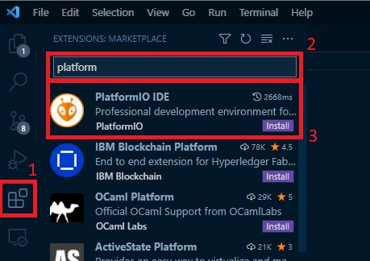
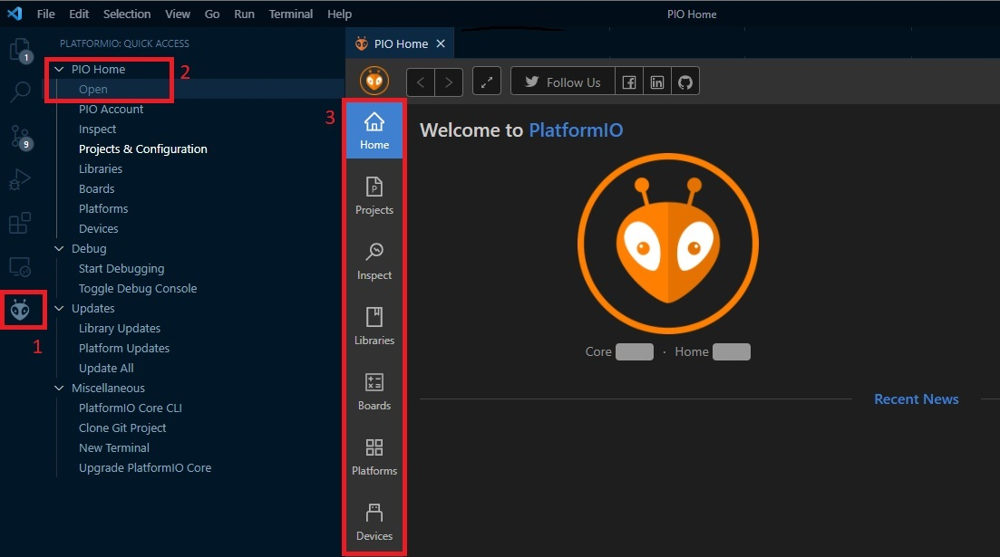
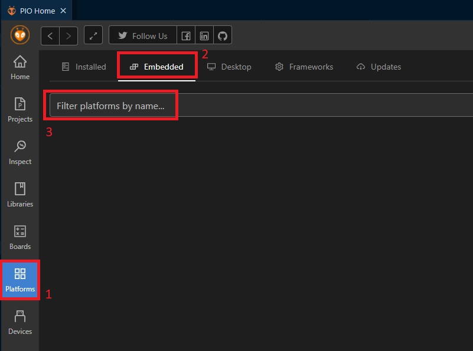
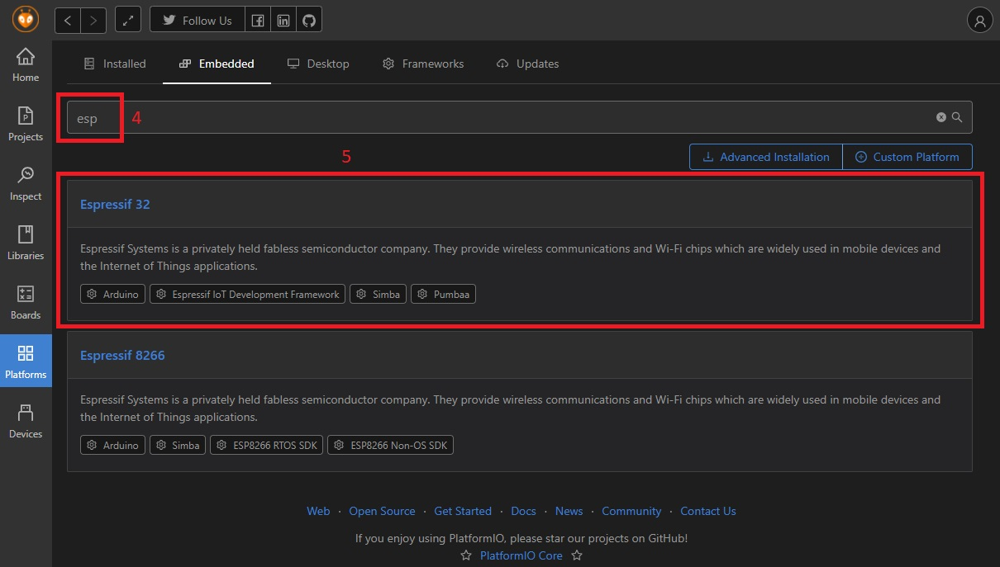
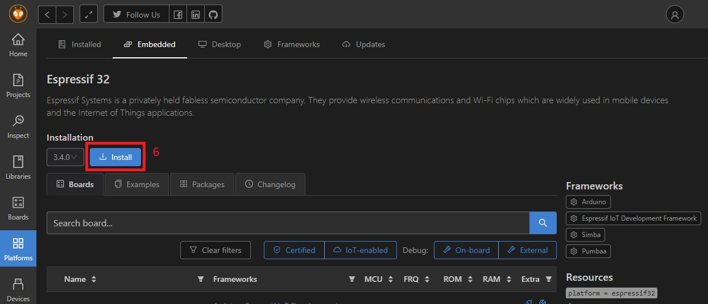

# Setting up your toolchain

## Install VScode

- Install VScode from [the official visual studio code website](https://code.visualstudio.com/).

## Install Platformio

> This is a quick guideline and won't be updated, please refer to the oficial documentation [on the platformio website](https://platformio.org/) for updated informations. It's pretty straight forward you can do it.

- Open VScode.

- Follow these three simple steps to install platformio.

1. select the extensions menu from the bar or use Ctrl+Shift+X

2. in the Extension search bar search platform

3. Locate the platformio extension and click the install button associated with it.

## Accessing platformIO home, menu and options

1. Click the platformIO icon on the VScode menubar.

2. Locate `PIO Home` and select `Open`

3. The platformIO Home will hopen

## Install platform and framework

1. from PIO Home, select `Platforms`.

2. Chose the `Embedded` tab.

3. Locathe the searchbar.

4. Search `esp`

5. Choose Espressif 32

6. Click `Install`

